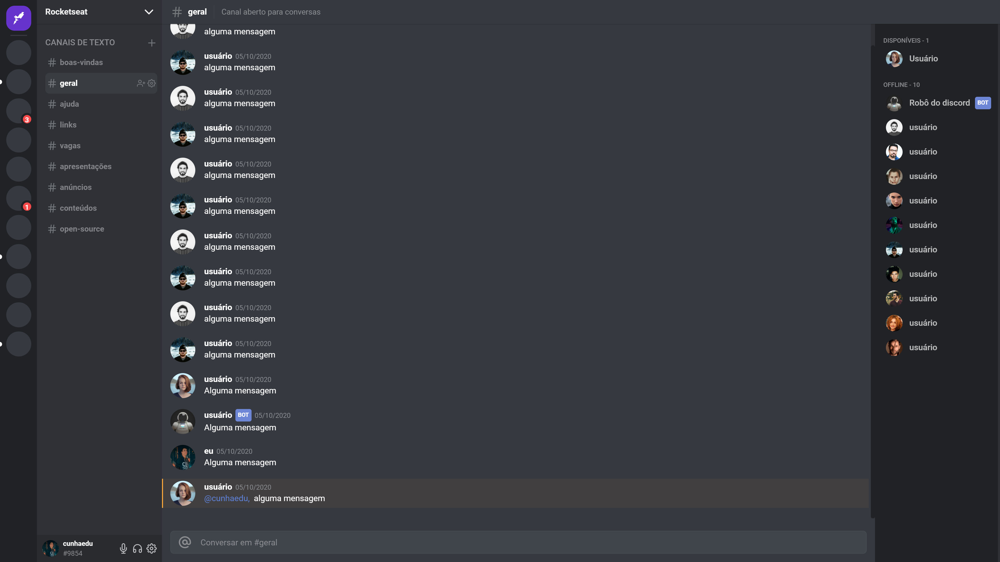

# Discord Clone

> Um clone parcial do Discord feito com Next.js e Chakra-UI

## :computer: Sobre o Projeto

**Esse clone foi baseado em um [vídeo](https://www.youtube.com/watch?v=x4FdZd2-_uU) do quadro UI-Clone da Rocketseat. No entanto, todo o conteúdo foi apresentado usando [React](https://pt-br.reactjs.org/) e [Styled-components](https://github.com/styled-components/styled-components), o qual eu adaptei para usar Next.js e Chakra-ui, apenas para de alguma forma por em prática esse conhecimento **

<p align="center">
   
</p>

## :construction_worker: Instalação

**Você vai precisar ter o [Node.js](https://nodejs.org/en/download/) instalado no seu computador. Feito isso, você pode clonar o projeto via HTTPS, rodando este comando:** 

```
git clone https://github.com/cunhaedu/discord-clone.git
```

## :runner: Como usar

```bash
npm run dev
# or
yarn dev
```

## :rocket:  Tecnologias

Este projeto foi desenvolvido com as seguintes tecnologias:

* [Next.js](https://nextjs.org/)
* [Chakra-ui](https://chakra-ui.com/)
* [Typescript](https://www.typescriptlang.org/)

## :postbox: Faq


**Questão:** O que você achou de usar interface declarativa com o chakra-ui?

**Resposta:** Foi a primeira vez que usei ele, e apenas a titulo de curiosidade, mas vi que ele tem muito potêncial e gostei bastante da forma como incluímos CSS dentro de um arquivo responsável pelo html e javascript. No entanto, ele se mostrou em pouco limitado em alguns aspectos mais avançados do CSS.

## :closed_book: Licença

Este projeto está sobre a [Licença MIT](https://github.com/cunhaedu/proffy/tree/master/LICENSE).

Feito por [Eduardo Assunção](https://github.com/cunhaedu)


